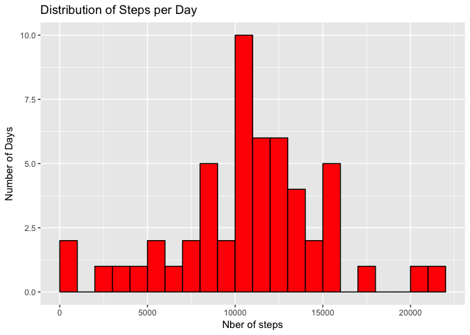

# Reproducible Research: Peer Assessment 1


## Loading and preprocessing the data

Let's read the files (directly in the zip with *fread* and a call to command line)


```r
library(data.table)
setwd("~/Documents/GitHub/RepData_PeerAssessment1")
mydata <- fread('unzip -cq activity.zip', stringsAsFactors = FALSE)
## I looked a bit inside mydata : 
# head(mydata)
# summary(mydata)
# str(mydata)
# 24*12
# unique(mydata$date)
# 24*12*61
```

From the first look at my data, we note that: 

 - we find the 3 columns we expected (steps, date, interval)
 - we find the 17,568 observations we expected, with 2304 of them without step data (NA)
 - more than half of the measures have 0 steps - that makes sense
 - intervalls run from 0 to 2355 (so from midnight to 11:55 pm), 24*12 = 288 measures per day
 - we find 61 days in October + November: 288*61=17,568 

We need a better way to measure the date/time (as POSIXlt uses 40 bytes per date,  I used *as.POSIXct* instead.)
I combined date (type chr) and interval (type int) into a date-time format in a 4th column. I have to reformat the time string with leading 0 for the *strptime* or *as.POSIXct* function to work. 


```r
mydata$mydatetime <- as.POSIXct(paste(mydata$date, formatC(mydata$interval, flag='0', width = 4)), "%Y-%m-%d %H%M", tz = "GMT")
```

---

## What is mean total number of steps taken per day?

1. We get the total number of steps per day with *aggregate()*, which will automatically remove the NA values.

Only 53 days out of 61 are left after removing the NAs. *summary()* gives us useful information, particularly that the range goes to a bit more than 21,000.


```r
mystepsperday<-aggregate(steps~date,sum,data=mydata)
summary(mystepsperday)
```

```
##      date               steps      
##  Length:53          Min.   :   41  
##  Class :character   1st Qu.: 8841  
##  Mode  :character   Median :10765  
##                     Mean   :10766  
##                     3rd Qu.:13294  
##                     Max.   :21194
```


2. Let's plot a histogram, using GG.

NB: a histogram represents quantitative data on the x-axis, while a bar plot shows qualitative data. Here, the number of steps is a quantitative measure, so it's an histogram. We cut in bins of 1000 steps (by fixing the *binwidth* and one *boundary* to 0). 


```r
library(ggplot2)
ggplot(data=mystepsperday, aes(steps)) + 
      labs(x ="Nber of steps", y="Number of Days", title = "Distribution of Steps per Day") +
      geom_histogram(color="black", fill="red", binwidth = 1000 , boundary =0) 
```

<!-- -->


3. The mean and median were given by *summary*, we can recalculate them individually


```r
#average steps per day and median steps per day
mean(mystepsperday$steps)
```

```
## [1] 10766.19
```

```r
median(mystepsperday$steps)
```

```
## [1] 10765
```


## What is the average daily activity pattern?

1. We average across all days the number of steps at a given interval. 

Then we plot it in a time series plot.
For readibility, we're using hours in the x-axis (instead of the strange numerical format of *interval*)


```r
myavginterval<-aggregate(steps~interval,mean,data=mydata)
## myavginterval$interval2 <- as.character(myavginterval$interval)
myavginterval$hour <- floor(myavginterval$interval/100)+(myavginterval$interval%%100)/60
summary(myavginterval)
```

```
##     interval          steps              hour       
##  Min.   :   0.0   Min.   :  0.000   Min.   : 0.000  
##  1st Qu.: 588.8   1st Qu.:  2.486   1st Qu.: 5.979  
##  Median :1177.5   Median : 34.113   Median :11.958  
##  Mean   :1177.5   Mean   : 37.383   Mean   :11.958  
##  3rd Qu.:1766.2   3rd Qu.: 52.835   3rd Qu.:17.938  
##  Max.   :2355.0   Max.   :206.170   Max.   :23.917
```

```r
ggplot(data=myavginterval, aes(x=hour, y=steps)) + 
      labs(x ="Moment of the Day (in 24hours)", y="Average Number of Steps", title = "Average Steps per Moment of the Day") +
      geom_line(color="blue", size =2) +
      coord_cartesian(xlim = c(0,24))
```

<!-- -->

2. Which 5-minute interval, on average across all the days in the dataset, contains the maximum number of steps?

We see it graphically around 9 o'clock, and the summary function showed that maximum is 206.17 steps. 

Let's have R find it for us: 


```r
myavginterval[which.max(myavginterval$steps),"interval"]
```

```
## [1] 835
```

So the most active interval in the day, on average, is the 08:35 to 08:40 interval. 


## Imputing missing values

1. Calculate and report the total number of missing values in the dataset (i.e. the total number of rows with 𝙽𝙰s)

We saw it in the initially *summary* : there are 2304 NAs observations. 
Let's do it again.  


```r
sum(is.na(mydata$steps))
```

```
## [1] 2304
```

By the way, it seems all those missing value come from the same 8 days. Let's check: 

```r
table(mydata$date[is.na(mydata$steps)])
```

```
## 
## 2012-10-01 2012-10-08 2012-11-01 2012-11-04 2012-11-09 2012-11-10 
##        288        288        288        288        288        288 
## 2012-11-14 2012-11-30 
##        288        288
```

That was a correct intuition: 8 days with all their 288 step data missing = 2304.

2. Devise a strategy for filling in all of the missing values in the dataset. 

After 30'' of thinking, it seems the strategy which is both simple and make sense is to use the mean across all days for that 5-minute interval. We have conveniently already calculated those means in *myavginterval*. 


3. Create a new dataset that is equal to the original dataset but with the missing data filled in.

Let's put this cleaned data in *myprocesseddata*. 
Then we look again at the histogram of total number of steps taken each day and Calculate and report the mean and median total number of steps taken per day. 


```r
myprocesseddata <- mydata
myprocesseddata$steps[is.na(mydata$steps)] <- myavginterval$steps
mynewstepsperday<-aggregate(steps~date,sum,data=myprocesseddata)
summary(mynewstepsperday)
```

```
##      date               steps      
##  Length:61          Min.   :   41  
##  Class :character   1st Qu.: 9819  
##  Mode  :character   Median :10766  
##                     Mean   :10766  
##                     3rd Qu.:12811  
##                     Max.   :21194
```

```r
ggplot(data=mynewstepsperday, aes(steps)) + 
      labs(x ="Nber of steps", y="Number of Days", title = "Distribution of Steps per Day") +
      geom_histogram(color="black", fill="red", binwidth = 1000 , boundary =0) 
```

<!-- -->

```r
mean(mynewstepsperday$steps)
```

```
## [1] 10766.19
```

```r
median(mynewstepsperday$steps)
```

```
## [1] 10766.19
```


Do these values differ from the estimates from the first part of the assignment? What is the impact of imputing missing data on the estimates of the total daily number of steps?

- we have basically added 8 days with exactly the same number of steps as the average day (10766.19). As a consequence: 
      - the mean is exactly the same with this new dataset as the orginal one
      - the median has slightly increased, and is now the same as the mean, probably because the 8 days we added were somewhere close the median, and now cover it.
      - the distribution has changed a bit, by growing significantly the one stack in the "middle": the stack corresponding to the 10,766 average steps (that's the 10,000-11,000 stack). That's where we added 8 days. The other stacks now appear a bit smaller.
      


## Are there differences in activity patterns between weekdays and weekends?


First, let's have a look at our averages per day, by separating the weekdays (in blue) from the week-ends (in red). 

``` { r echo = TRUE }
mystepsperday$weekday <- weekdays(as.POSIXct(mystepsperday$date, "%Y-%m-%d", tz="GMT")) %in% c("Monday", "Tuesday", "Wednesday", "Thursday", "Friday")
      
ggplot(data=mystepsperday, aes(x=date, y=steps, colour = weekday)) + 
      labs(x ="Day", y="Average Number of Steps", title = "Average Steps per Day Over 51 Day") +
      geom_bar(stat="identity", fill= "white")  
      
summary(mystepsperday$steps[!mystepsperday$weekday])
summary(mystepsperday$steps[mystepsperday$weekday])      
```


So we see the guy has been on average **more active on weekends** (mean 12407 steps > 10177). Althought the weekdays are much more varied (with min and max of 41 and 21,194 steps).

But this comes from our previous (unprocessed) data analysis. Let's reuse the *myprocesseddata* with the filled-in values, and create a new factor variable in the dataset with two levels – “weekday” and “weekend”. 


```r
mydata$weekday <- !(weekdays(mydata$mydatetime) %in% c("Sunday", "Saturday"))
myavginterval$stepsWeekday <-aggregate(steps ~ interval ,mean,data=mydata[mydata$weekday])$steps
myavginterval$stepsWeekend <-aggregate(steps ~ interval ,mean,data=mydata[!mydata$weekday])$steps

summary(myavginterval)
```

```
##     interval          steps              hour         stepsWeekday    
##  Min.   :   0.0   Min.   :  0.000   Min.   : 0.000   Min.   :  0.000  
##  1st Qu.: 588.8   1st Qu.:  2.486   1st Qu.: 5.979   1st Qu.:  2.218  
##  Median :1177.5   Median : 34.113   Median :11.958   Median : 23.974  
##  Mean   :1177.5   Mean   : 37.383   Mean   :11.958   Mean   : 35.338  
##  3rd Qu.:1766.2   3rd Qu.: 52.835   3rd Qu.:17.938   3rd Qu.: 51.872  
##  Max.   :2355.0   Max.   :206.170   Max.   :23.917   Max.   :234.103  
##   stepsWeekend    
##  Min.   :  0.000  
##  1st Qu.:  1.107  
##  Median : 32.036  
##  Mean   : 43.078  
##  3rd Qu.: 75.571  
##  Max.   :175.000
```


Make a panel plot containing a time series plot (i.e. 𝚝𝚢𝚙𝚎 = "𝚕") of the 5-minute interval (x-axis) and the average number of steps taken, averaged across all weekday days or weekend days (y-axis). See the README file in the GitHub repository to see an example of what this plot should look like using simulated data.

Let's look at the activity patterns, and plot separately the average weekday and the average weekend day. 
For this, we'll extend our *myavginterval* table with 2 columns, to include the averages for weekdays and for weekends.


```r
mydata$weekday <- weekdays(mydata$mydatetime) %in% c("Monday", "Tuesday", "Wednesday", "Thursday", "Friday")
myavginterval$stepsWeekday <-aggregate(steps ~ interval ,mean,data=mydata[mydata$weekday])$steps
myavginterval$stepsWeekend <-aggregate(steps ~ interval ,mean,data=mydata[!mydata$weekday])$steps

summary(myavginterval)
```

```
##     interval          steps              hour         stepsWeekday    
##  Min.   :   0.0   Min.   :  0.000   Min.   : 0.000   Min.   :  0.000  
##  1st Qu.: 588.8   1st Qu.:  2.486   1st Qu.: 5.979   1st Qu.:  2.218  
##  Median :1177.5   Median : 34.113   Median :11.958   Median : 23.974  
##  Mean   :1177.5   Mean   : 37.383   Mean   :11.958   Mean   : 35.338  
##  3rd Qu.:1766.2   3rd Qu.: 52.835   3rd Qu.:17.938   3rd Qu.: 51.872  
##  Max.   :2355.0   Max.   :206.170   Max.   :23.917   Max.   :234.103  
##   stepsWeekend    
##  Min.   :  0.000  
##  1st Qu.:  1.107  
##  Median : 32.036  
##  Mean   : 43.078  
##  3rd Qu.: 75.571  
##  Max.   :175.000
```

```r
ggplot(data=melt(myavginterval[,names(myavginterval)!="interval"],id.vars="hour"), aes(x=hour, y = value, colour=variable)) +
      coord_cartesian(xlim = c(0,24)) +  geom_line(size =1) +          
      labs(x ="Moment of the Day (in 24hours)", y="Average Number of Steps", title = "Average Steps per Moment of the Day")
```

<!-- -->

```r
ggplot(data=data.frame(hour=myavginterval$hour, stepsgap = myavginterval$stepsWeekend-myavginterval$stepsWeekday), aes(x=hour, y=stepsgap)) +
      coord_cartesian(xlim = c(0,24)) +  geom_line(size =2) +          
      labs(x ="Moment of the Day (in 24hours)", y="Average Number of Steps", title = "Difference between Weekdays and Weekends in average Steps per Moment of the Day")
```

<!-- -->

So, by comparing the blue line against the green line, we conclude that the **activity patterns are clearly different**. 
It's even more obvious when we look at the difference (Weekends-Weekdays), with the black line. On weekends: 

- the guy probably woke up later
- he was more active during the day and in the evening
- he is marginally more active in the late evening (probably sitting in a bar...)


